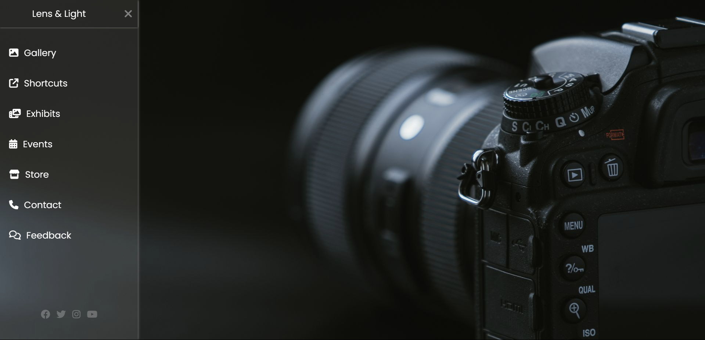

# CSS-Mini-Project
Absolutely! Here's the full markdown for the `README.md` file — you can copy it directly:

---

# 🎨 CSS Mini Project

This is a simple yet visually appealing mini project built entirely using **HTML** and **CSS**. It serves as a foundational project for understanding layout, styling, and responsiveness using only CSS. Ideal for beginners looking to practice modern CSS design principles.

## 🖼️ Preview



---

## 🚀 Features

- Responsive layout  
- Clean and modern UI  
- Pure HTML + CSS (No JavaScript)  
- Easy to customize and extend  

---

## 📁 Project Structure

```

CSS-Mini-Project/
├── index.html         # Main HTML file
├── style.css          # Custom CSS styling
└── README.md          # Project documentation

````

---

## 🛠️ How to Run the Project

1. Clone the repository:
   ```bash
   git clone https://github.com/aniprogramer/CSS-Mini-Project.git
   ```

2. Navigate to the folder:

   ```bash
   cd CSS-Mini-Project
   ```

3. Open `index.html` in your browser:

   * You can double-click the file, or
   * Use Live Server in VS Code

---

## 📚 Technologies Used

* HTML5
* CSS3 (Flexbox, Media Queries, Custom Styling)

---

## 📈 Learning Outcomes

* Understanding of CSS layout techniques
* Improved skills in styling web elements
* Practice with basic responsive design

---

## 🙌 Contributing

Contributions are welcome! If you have suggestions or want to add new components, feel free to fork the repo and create a pull request.

---

## 📄 License

This project is licensed under the [MIT License](LICENSE).

---

## 👨‍💻 Author

**Aniket** – [@aniprogramer](https://github.com/aniprogramer)

---

⭐️ Don't forget to **star** the repository if you found it helpful!

```

---

Let me know if you also want a deploy button or GitHub Pages setup instructions.
```
